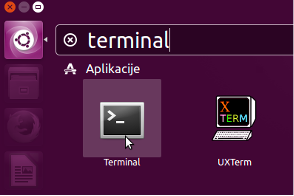

# Podstawy Linuxa

Jeśli szukasz wersję w języku angielsku - [README.md](./README.md).

## Surwiwal

1. Z GUI do Terminala:

   

2. Z terminala GUI:

   ```bash
   ls
   xdg-open .
   ```

3. Przejrzyj zawartość katalogu $HOME, z pomocą ls :

   ```bash
   #
   ls

   # $HOME stores
   # path to your home directory
   ls $HOME

   echo $HOME
   ```

4. Surwiwal 1 - gdzie jestem? Dlaczego moje komendy zwracają `No such file or directory` albo `Permission denided`? Dwie komendy pomogą Tobie:

   ```bash
   pwd

   ls
   ```

5. Surwiwal 2 - jak wrócić do swojego katalogu domowego?

   ```bash
   # glowny katalog w linuxie to: / , na windowsie byłby to C:
   cd /
   pwd

   # szybki powrów do katalogu domowego
   cd
   # zobaczmy czy to jest prawda:
   pwd

   # i jescze raz
   cd /
   pwd
   ls

   # ~ oznacza katalog domowy
   # czyli zmien katalog na ~
   cd ~
   ```

6. Przygotowanie do pracy z katalogami, zainstalujmy `tree`:

   ```bash
   sudo apt-get update
   sudo apt install tree
   ```

   Sudo? [Mamy oczywiście xkcd pokazujący korzyści sudo!](https://xkcd.com/149/).

7. Praca z kalalogami:

   ```bash
   mkdir poland
   cd poland
   mkdir cities
   cd cities
   mkdir gdansk
   ls
   mkdir warszawa
   mkdir wroclaw
   mkdir krakow
   ls
   cd ..
   pwd
   cd ..

   tree

   tree ../poland
   ```

   Po uruchmieniu `tree` powinieneś zobaczyć:

   ```
   poland
   \- cities/
      |- gdansk/
      |- warszawa/
      |- wroclaw/
      \- krakow/
   ```

8. Przechodzenie po katalogach z `cd ŚCIEŻKA`:

   ```bash
   # go in
   pwd
   cd cities/krakow
   pwd

   # go out
   cd ../..
   ```

9. Zauważ:

   ```bash
   # relatywna o miejsca gdzie jesteś
   ls cities

   # absolutna/pełna ścieżka
   ls /home/
   ls ~
   ```

10. Dodaj katalog `villages` i podkatalogi dla przykładowych wsi w Polsce:

    ```
    poland
     |- cities/
     |   |- gdansk/
     |   |- krakow/
     |   |- warszawa/
     |   \- wroclaw/
     |
     \- villages/
        |- nowawies
        \- zytno
    ```

11. Surwival 2 - `vim`/`vi`:

    - Zainstaluj vim:

      ```bash
      sudo apt-get install vim
      ```

    - wrócmy spowrotem do katalogu domowego: `cd`

    - czas uruchomić `vim`:

      ```bash
      vim learning_vim.txt
      ```

    - Jak wyjść, jeśli niczego nie dodaliśmy:

      1. ESC ESC
      2. :q
      3. ENTER

    - iii! Uuuu.. jednak coś wpisałem (insert mode: `ESC ESC i`), chce po prostu wyjść bez zapisywania:

      1. ESC ESC
      2. :q!
      3. ENTER

    - ok. Jestem gotowa, jedem gotowy, aby zmienić plik:

      1. `vim learning_vim.txt`
      2. ESC ESC
      3. i
      4. Please add sth, e.g., `Uwielbiam vim!`
      5. ESC ESC
      6. :wq
      7. ENTER
      8. Zweryfikujmy czy zapisaliśmy poprawnie plik:

         ```bash
         cat learning_vim.txt
         ```

12. Surwiwal 4 - `emacs` / `nano`:

    ```bash
    # jak wyzej
    nano learning_nano.txt
    ```

    Zauważ, `^` znaczy CTL/CONTROL.

13. Jeśli szukasz jakiegoś prostego edytora podobnego do Notebook na Windowsie: `gedit p.txt`

## Zauważ

1. Jeśli komenda nie wypisuje niczego na ekran, znaczy się, że wszystko się udało
2. Korzystaj z auto uzupełninia: `TAB` `TAB`

## Praca z plikami

1. Wrócmy spowrotem do naszego katalogu domowego, utwórzmy folder `workspace` i przejdźmy do niego:

   ```bash
   cd
   mkdir workspace
   cd workspace
   ```

2. Pliki tworzymy za pomocą `touch` ([to remember it](https://cdn.britannica.com/77/2577-004-DA7549AE/The-Creation-of-Adam-ceiling-fresco-Michelangelo.jpg?s=1500x700&q=85)), w tym ćwiczeniu skorzystamy z `echo`, aby dodać zawartość:

   ```bash

   touch myfile.txt # tworzymy pusty plik

   echo "Ubuntu 18.04" > myfile.txt
   echo "Ubuntu 20.04" >> myfile.txt

   cat myfile.txt
   echo "Mint" >> myfile.txt
   echo "Debian" >> myfile.txt
   echo "Redhat" >> myfile.txt
   echo "Linux" >> myfile.txt

   cat myfile.txt
   ```

3. Oczywiśćie, moglibyśmy skorzystać z atoma:

   ```bash
   atom myfile.txt
   ```

   Jak zainstalować `atom`, google pomoże, jeśli nie chcesz wyszukiwać w tym momencie tutaj znajdziesz właściwą komendę [snapcraft.io/install/atom/ubuntu](https://snapcraft.io/install/atom/ubuntu).

4. `grep` jest jadną z najczęściej wykorzystywaną komendą w CLI oraz skryptach. Zauważ grep domyślnie zwraca uwagę na duże i małe litery:

   ```bash
   grep Linux myfile.txt

   grep Ubuntu myfile.txt
   # compare with:
   grep ubuntu myfile.txt
   ```

   ```
   grep -i ubuntu myfile.txt
   ```

5. Często używany `grep` do analizy logów:

   ```bash
   grep -i Error /var/log/*log
   # alternative to `wc -l`
   grep -c -i Error /var/log/*log
   ```

   Zadanie: na zasadzie analogi, wyszukaj swojego użytkownika (komenda `whoami` przypomni Ci jako kto jesteś zalogowana) w /etc/passwd.

6. Jako kopiować pliki, z pomocą przychodzi `cp` :

   ```bash
   cp myfile.txt myfile2.txt

   ls

   # możesz wykonać `grep`
   # na wielu plikach jednoczesnie
   # poniżej - wszystkie pliki konczace sie
   # na `.txt`
   grep Linux *.txt
   ```

7. Jak prenieść plik plik z jednego katalogu do drugiego? `mv` - również służy do zmiany nazwy plików lub katalogów.

   ```bash
   mkdir mydirectory
   mv myfile2.txt mydirectory
   ls mydirectory
   tree ../

   # let's move the file back
   # to the current directory `.`
   $ mv mydirectory/myfile2 .
   ```

8. `mv` służy również do zmiany nazwy foderów oraz plików, wróćmy do naszych katalogów o Polsce i zmienmy nazwę naszego katalogu `cities` na `miasta`:

   ```bash
   cd ~
   cd poland
   ls
   # sb asked us to use Polish word for cities
   # - miasta
   mv cities miasta
   ls
   tree ../poland
   ```

9. A co jeśli musimy mieć i po PL jak i ENG? Przekopijmy zawartość `miasta`:

   ```bash
   cp -r miasta cities
   cd ..
   tree poland
   ```

   Powineneś zobaczyć zarówno `miasta` jak i `cities`.

10. Wrócmy do naszego katalogu, gdzie mieliśmy pliki z nazwami dystrybucji linuxa, aby zobaczyć jak skasować plik z pomocą `rm`:

    ```bash
    cd
    cd workspace
    rm myfile2.txt
    ```

11. ... a teraz spowrotem do katalogów z miastami, aby zobaczyć jak kasujemy katalogi (puste oraz z zawartością):

    ```bash
    cd
    ls poland
    rmdir poland/cities/warszawa

    # czy to zadziała?
    rmdir poland/cities

    # nie? z pomocą przychodzi rm -r
    rm -r poland/cities
    ```

12. Utwórz następujące katalogi i pliki, pamiętaj o komendzie tree (`*.txt` są plikami):

    ```
    biologia/
    |- drzewa
    |      |- lisciaste.txt
    |      \- iglaste.txt
    |
    \- zwierzeta
        |- drapiezniki
        |   \- koty.txt
        \- roslinozerne
            \- rogate.txt
    ```

    Po utworzeniu.
    1. Przenieś `koty.txt` i `rogate.txt` bezpośrednio do katalogu zwierzeta,
    2. Następnie przekopiuj iglaste.txt do katalogu domowego (sprawdź czy wykonałeś poprawenie z `ls ~`),
    3. Skasuj katalog `zwierzeta`,
    4. Skasuj katalog `biologia`.

## Zmienne środowiskowe i ukryte pliki

1. W Linuxie, mamy ukryte pliki. Nazwy ukrytych plików zaczynają się od `.`:

   ```bash
   cd
   ls -a
   ls -la
   ls -la | grep bash
   ```

2. Zmienne środowiskowe wykorzystujemy bardzo często w automatyzacjach i korzysta z nich wiele komend i programów na Linuxie:

   ```bash
   printenv
   printenv | grep HOME=
   printenv | grep LANG=

   echo $HOME
   ```

3. Wypisanie zmiannych środowiskowych:

   ```bash
   # porownaj:
   $ echo "$HOME"
   $ echo '$HOME'

   # zawsze w skryptach
   # zmienne srodowiskowe umieszczaj 
   # miedzy { i }
   $ echo "${HOME}"
   ```

4. Zmienne środowiskowe i `echo`:

   ```bash
   cd ~
   mkdir tmp
   cd tmp

   echo "$HOME" > home.txt
   cat home.txt
   ```

5. Zmienne środowiskowe i `$HOME/.bashrc`, dodadanie powitania oraz naszej własnej zmiennej środowiskowej:

   ```bash
   atom $HOME/.bashrc
   ```

   Na samym końcu `~/.bashrc` dodajmy powitanie oraz zmienną środowiskową i zapisz plik:

   ```bash
   echo "Hi ${USER}!"
   export MY_PHONE=9999
   ```

   Po uruchomienou bash lub otworzenie nowego okna terminalu, zobaczysz powitania i będzie dostępna nowa zmienna:

   ```bash
   # notice TAB TAB works
   echo $MY_PHONE
   ```

6. Ad hoc definicja zmiennych środowiskowych:

   ```bash
   export SHOP_USER=natalia
   echo "$SHOP_USER"
   ```

7. Create your first bash script `my_script.sh` with the following content:

   ```bash
   #!/bin/bash

   echo "Hi ${USER}! Nice to meet you!"
   echo "Your home directory is ${HOME}"
   echo "Your configured language is ${LANG}"
   ```

   and run it:

   ```bash
   bash my_script.sh
   ```

## Where can I find X?

```bash
cd
find . -iname *.txt

# ensure we get the file:
find . -iname *.txt -type f

# find in the home directory `~`
# a directory `-type d`
# with name `poland`
find ~ -iname poland -type d
```

### Working with text files

1. You got an export from your ecommerce shop `koszyk1.txt`:

   ```
   milk,10,1zl
   bread,1,4zl
   ```

   Using `cut`:

   ```bash
   cut -d',' -f1 koszyk1.txt
   cat koszyk1.txt | cut -d',' -f1
   ```

   extract:

   ```
   1zl
   4zl
   ```

   Bonus task:

   1. Print the user names from `/etc/passwd`
   2. Extract month and days from `/var/log/syslog`

2. Another day, another weird export from an online shop `koszyk2.txt`:

   ```

   product=mleko
   price=1
   product=chleb
   price=4
   ```

   With help of `cut` and `paste`, print on the screen:

   ```

   mleko 1
   chleb 4
   ```

   Hint:

   ```bash
   cat koszyk2.txt | paste - -
   ```

3. Let's learn how to replace strings, assuming we have `koszyk3.txt` with the following content:

   ```
   product_category: mleczne
   ```

   Our task is to replace `mleczne` (Polish word for the diary products) with the category ID `M0`:

   ```
   product_category: M0
   ```

   Hint:

   ```bash
   sed 's/category/cat/g'
   ```

4. `tr` is very useful when you need to replace a single character:

   ```bash
   cat koszyk3.txt | tr ':' '='
   ```
   
   or remove it:

   ```bash
   cat koszyk3.txt | tr -d ':'
   ```

5. Please find out what `head`, `tail`, and `less` do:

   ```bash
   less /var/log/syslog
   tail /var/log/syslog
   head /var/log/syslog
   head -n 10 /var/log/syslog
   ```

6. Given the following basket export structure (notice `*.txt` are files):

   ```
   basket
   |- chocolates
   |   \- products.txt
   |      wedel,2
   |      goplana,3
   |
   |- dairy
       \- products.txt
          mlekovita,5
          zimnemleko,4
   ```

   1. With one command print the price for each of the item:

      ```
      2
      3
      5
      4
      ```

   2. With one command (find it with help of Google on stackoverflow), calculate the basket value:

      ```
      14
      ```

   Notice how easy is to find a solution for a common problem in bash.

## Homework

Install one from these two:

- [ohmybash](https://ohmybash.nntoan.com/) / [bash-it](https://github.com/Bash-it/bash-it) if you are on Linux
- [ohmyzsh](https://github.com/ohmyzsh/ohmyzsh) if you are on Macos ([a blog post for MacOS](https://towardsdatascience.com/the-ultimate-guide-to-your-terminal-makeover-e11f9b87ac99?gi=5b5538f07a5d#367b)) or you are on Linux ([blog post](https://vitux.com/ubuntu-zsh-shell/))

There are many plugins that gives you super powers in your terminal, you can check the top plugins on [this page](https://safjan.com/top-popular-zsh-plugins-on-github-2021/).

## Dodatkowe

- [Better Bash Scripting in 15 Minutes ](http://robertmuth.blogspot.com/2012/08/better-bash-scripting-in-15-minutes.html)
