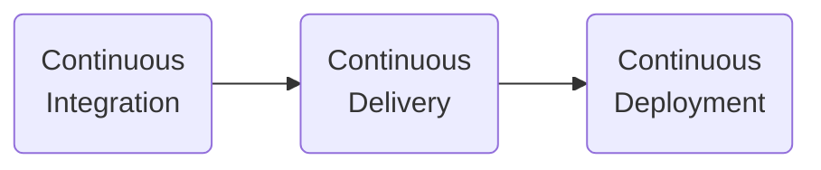

# Continuous Deployment



## Deployment to Heroku

Let's today setup a continuous deployment pipeline for our application. Before, we teach our CI/CD pipeline how to bring our application to the clouds (in this exercise PaaS Heroku), we need to test the setup on our workstation.

Heroku is one of the first PaaS platforms that achieved large commercial success. The Heroku engineers created the famous [12factor apps](https://12factor.net/). Check also [Heroku (Engineering) Values](https://gist.github.com/adamwiggins/5687294).

1. Setup an account on [heroku.com](https://www.heroku.com)

2. Please go to your hello-world python project from the last exercises. Follow the README.md and use Makefile targets to verify whether your application works.

3. Let's see whether we can start our application with [gunicorn](https://gunicorn.org):

   ```bash
   gunicorn hello_world:app
   ```

   Gunicorn is a Python WSGI HTTP Server for UNIX. The default flask WSGI is only for development purposes. It is not suited for production.

3. The first step is to tell Heroku how to run our application. For this purpose, we will create a *Procfile* with the following content:

   ```
   web: gunicorn hello_world:app
   ```

   You can refer to [the official documentations](https://devcenter.heroku.com/articles/getting-started-with-python) for more information.

4. How shall we test it? Luckily, Heroku provides us a CLI that let's to run our application as it would in the cloud. Follow the instruction [devcenter.heroku.com/articles/heroku-cli](https://devcenter.heroku.com/articles/heroku-cli) to install the heroku CLI (hint: use `snap`).

5. Let's verify whether Heroku will be able to run our application:

   ```bash
   heroku local
   ```

   Please use `curl` or `http` to query your app.

6. Time to deploy our app to Heroku:

   ```bash
   # first we need to login to Heroku
   heroku login -i

   # create the app at the heroku side
   heroku create

   # refresh the Heroku web UI, you should see your
   # app name
   # (your internet browser)

   # notice
   # heroku uses git-a
   git remote -v

   # verify whether you commited Procfile to your git repo
   git status

   # deploy
   git push heroku master

   # Check the logs
   heroku logs
   ```

   to ensure that you have your files also in github:

   ```bash
   git push
   ```

   An illustration how your local git repository is connected to two remotes (`git remote -v`):

   ```mermaid
   flowchart BT
      l(local\ngit) -- master --> H(remote\nheroku)
      l -- master --> G(remote\ngithub)
   ```

7. Go to the web interface and open your application to see whether it works.

## Deploy to Heroku with Github actions

Please use the Github Action to deploy our application on push to the master/main branch. There is a ready to use action [deploy to heroku](https://github.com/marketplace/actions/deploy-to-heroku).

<!-- ## Automation Tools Next time: [ansible]() -->

## PaaS vs IaaS vs CaaS

Benefits of using PaaS:

```bash
heroku ps:scale web=0
heroku ps:scale web=1
```

## Badge for CI/CD status

Add a status badge to your project `README.md`, following the [official documentation](
https://docs.github.com/en/actions/monitoring-and-troubleshooting-workflows/adding-a-workflow-status-badge).

## [+] Simple monitoring

[statuscake.com](https://www.statuscake.com) is a simple, yet powerful tool that informs us when our application is down. It checks from servers from around a world whether clients are able to use our service. Let's check how it works:

1. Create an account on statuscake.com
2. Create a contact group
3. Add a Uptime monitoring test:

   - URL - url of your app on Heroku
   - Name - as you wish

4. Change the test to make it fail, e.g., add the path to URL that our application is not handling.

5. After observing few errors, please change URL to the correct one.

## Misc

- [Programming Katas](http://codekata.com/kata/kata01-supermarket-pricing/)
- [fswatch](https://github.com/emcrisostomo/fswatch)
- [mutagen](https://github.com/mutagen-io/mutagen) - sync with a remote machine
- [vagrant](https://www.vagrantup.com/) - automatize a VM creation
- https://www.netlify.com/ - popular alternative to Heroku
